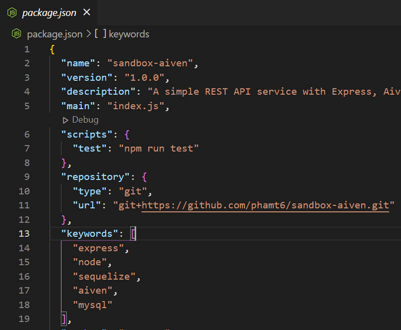
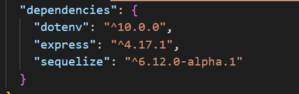
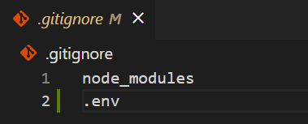

<p align="center">
  <a href="https://aiven.io/">
    
  </a>

  <p align="center">
    Build a REST API with NodeJS, Sequelize, and Aiven MySQL
    <br>
    <a href="https://github.com/aiven/devportal/issues">Report bug</a>
    ·
    <a href="https://github.com/aiven/devportal/issues">Request feature</a>
  </p>
</p>


## Table of contents

- [Introduction](#introduction)
- [Getting started](#getting-started)
- [Requirements](#requirements)
- [Project structure setup](#project-structure-setup)
- [Setup Express server](#setup-expresss-server)
- [Sequelize CLI](#sequelize-cli)
- [Build REST API](#build-rest-api)
- [Final words](#final-words)

## Introduction
This document will guide you to build a simple REST API service with NodeJS and utilize Aiven for MySQL service to flow data within your Express application with Sequelize as the ORM solution. Sequelize as a tool supports Postgres, MySQL, MariaDB, SQLite, Microsoft SQL Server and lets developers interact with their relational database using Javascript instead of writing SQL queries. ORMs such as Sequelize are designed to write correct and optimized SQL queries, easy to maintain and update, as well as provide more security against SQL injection attacks.

## Requirements
In order to make the most out of this guide, you are expected to have some previous experience working with Javascript, general understanding of relational databases. You will also need to install NodeJS on your working machine, create a free Aiven account to host your MySQL service. Further setup instructions for getting started with Aiven can be found from [Aiven Help](https://help.aiven.io/en/articles/2820646-getting-started-with-aiven-for-mysql)

## Getting started
Here is the list of tools that we will be using to build our sandbox project:
- [NodeJS](https://nodejs.org/en/download/)
- [Sequelize](https://sequelize.org/master/)
- [Visual Studio Code](https://code.visualstudio.com/) or your favorite IDE

Other dependencies
- [dotenv](https://www.npmjs.com/package/dotenv)
- [Express](https://www.npmjs.com/package/express)
- [sequelize-cli](https://github.com/sequelize/cli)
- [fs](https://www.npmjs.com/package/fs)
- [mysql2](https://www.npmjs.com/package/mysql2)

## Project structure setup
Initializing a new Node project is easy by running the command `npm init` within your Terminal. The `npm` command helps us to set up our project folder with the provided information from your answers. A new file is now created under your project folder as `package.json`, its content looks somewhat as in the following



Next, we install the project dependencies with the following command
```console
npm install --save express dotenv sequelize fs mysql2
```

Once the installation is complete, a new folder called `node_modules` is added under your project structure, where NPM keeps the source code of installed packages. Within the `package.json` file, you will find the details of the dependencies that have been added to your current project.



The `.env` file will be the place where we keep environment variables and protect secure information such as authentication data, port number, database host, etc.

The `.gitignore` file content helps us specify which files and folders are to be excluded from our repository, such as `.env` file and `node_modules` folder. This will prevent us to accidentally uploading our `.env` file with all credentials to a public repository.



## Setup Express server
First, we will use Express to help us create a new API server using the following code snippet

```javascript
const express = require('express');

const app = express();

app.get('/', (req, res) => {
    res.send('Hello world');
});

app.listen(3000, () => {
    console.log(`Server started on PORT 3000`);
});
```

Start your Express server by executing the following command within your Terminal
```console
node index.js
```

If your server is working correctly, you should now be able to navigate to [localhost:3000](localhost:3000/) and be greeted with a **Hello World** message.

## Sequelize CLI
Now we will initialize our Sequelize project by running the following command in the Terminal

```console
npx sequelize-cli init
```

These folders have now been created under your project: 
- **config**: contains config file, which tells CLI how to connect with database
- **migrations**: contains all models for your project
- **models**: contains all migration files
- **seeders**: contains all seed files

The `ca.pem` file is required to establish a connection with your **Aiven for MySQL** database and can be downloaded from the Aiven service interface. I will place it under the same `config` folder for easy reference. You will also need to create an `.env` file at the root of your project folder, and provide the following parameters (Database Name, Host, Port, User, Password) from your Aiven Console so you can make a reference to them with the `dotenv` package.


Rename the `config.json` file to `config.js` and update its content to the following to instruct `sequelize` of how to connect to our database. 

```javascript
require('dotenv').config();
const fs = require('fs');

const {
  DB_USERNAME,
  DB_PWD,
  DB_PORT,
  DB_HOST,
  DB_NAME
} = process.env;

module.exports = {
  "development": {
    "username": DB_USERNAME,
    "password": DB_PWD,
    "database": DB_NAME + '_dev',
    "dialect": "mysql",
    "dialectOptions": {
      "host": DB_HOST,
      "port": DB_PORT,
      "ssl": {
        ca: fs.readFileSync(__dirname + '/ca.pem')
      }
    }
  },
  "test": {
    "username": DB_USERNAME,
    "password": DB_PWD,
    "database": DB_NAME + 'test',
    "dialect": "mysql",
    "dialectOptions": {
      "host": DB_HOST,
      "port": DB_PORT,
      "ssl": {
        ca: fs.readFileSync(__dirname + '/ca.pem')
      }
    }
  },
  "production": {
    "username": DB_USERNAME,
    "password": DB_PWD,
    "database": DB_NAME + 'prod',
    "dialect": "mysql",
    "dialectOptions": {
      "host": DB_HOST,
      "port": DB_PORT,
      "ssl": {
        ca: fs.readFileSync(__dirname + '/ca.pem')
      }
    }
  }
}
```

In real use cases, configurations for `development` and `test` environment are different from `production` but we keep them the same for now. Other options for configuration can be referenced from [Sequelize documentation](https://sequelize.org/master/class/lib/sequelize.js~Sequelize.html#instance-constructor-constructor).

With all configurations in place, we are now ready to create a new database for our application. We can do that by running the following command in the Terminal:

```console
npx sequelize-cli db:create
```

The output should look somewhat as follows:
```console
Sequelize CLI [Node: 16.13.0, CLI: 6.3.0, ORM: 6.12.0-alpha.1]

Loaded configuration file "config\config.js".
Using environment "development".
Database defaultdb_dev created.
```

Let's populate some data, starting with creating a table within our connected database. The CLI will help us create a `Model` which acts as a representation of the table we are creating or updating. We can achieve this with the following command:

```console
npx sequelize-cli model:generate --name Post --attributes title:string,content:string,author:string
```

Output
```console
Sequelize CLI [Node: 16.13.0, CLI: 6.3.0, ORM: 6.12.0-alpha.1]

New model was created at C:\Users\black\Documents\sandbox-aiven\models\post.js .
New migration was created at C:\Users\black\Documents\sandbox-aiven\migrations\20211121181004-create-post.js
```

The output message indicates that two files have been created under `models` and `migrations` folders of our project. While the content of the `models\post.js` file describes a plan or the blueprint of the Post table, the content of the `migrations` folder helps us to actually create a `Post` table and write some data into our database with the following command:

```console
npx sequelize-cli db:migrate
```

Output
```console
Sequelize CLI [Node: 16.13.0, CLI: 6.3.0, ORM: 6.12.0-alpha.1]

Loaded configuration file "config\config.js".
Using environment "development".
== 20211121181004-create-post: migrating =======
== 20211121181004-create-post: migrated (0.180s)
```

Now let's add some sample data to our table with Seed file.
```console
npx sequelize-cli seed:generate --name sample-posts
```
Output
```console
Sequelize CLI [Node: 16.13.0, CLI: 6.3.0, ORM: 6.12.0-alpha.1]

seeders folder at "C:\Users\black\Documents\sandbox-aiven\seeders" already exists.
New seed was created at C:\Users\black\Documents\sandbox-aiven\seeders\20211121182555-sample-posts.js .
```

Now if you navigate under the new Seed file that has just been created, there are the `Up()` and `Down()` functions which correspondingly let us define **how to introduce new changes**, and **how to undo changes**. We will edit them as follows to add some new sample post data:

```javascript
let now = new Date();

module.exports = {
  up: async (queryInterface, Sequelize) => {
    await queryInterface.bulkInsert('Posts', [{
      title: 'My first post',
      content: 'Content of my first post',
      author: 'Adminstrator',
      createdAt: now,
      updatedAt: now
    }, {
      title: 'My second post',
      content: 'Content of my second post',
      author: 'Someone else',
      createdAt: now,
      updatedAt: now
    },{
      title: 'My first post',
      content: 'This is definitely working!',
      author: 'Another tester',
      createdAt: now,
      updatedAt: now
    }], {});
  },

  down: async (queryInterface, Sequelize) => {
    /**
     * Add commands to revert seed here.
     *
     * Example:
     * await queryInterface.bulkDelete('People', null, {});
     */
  }
};
```

Finally, the following command will transfer those test posts:
```console
npx sequelize-cli db:seed:all
```
Output
```console
Sequelize CLI [Node: 16.13.0, CLI: 6.3.0, ORM: 6.12.0-alpha.1]

Loaded configuration file "config\config.js".
Using environment "development".
== 20211121182555-sample-posts: migrating =======
== 20211121182555-sample-posts: migrated (0.037s)
```

## Build REST API
Next, we will add some extra Javascript code to complete our application as a REST API with some test routes. First, we need to modify the `models/index.js` file so that it will look for the correct configuration under `config.js` file instead of `config.json`

```javascript
const config = require(__dirname + '/../config/config.js')[env];
// instead of
// const config = require(__dirname + '/../config/config.json')[env];
```

Navigate to `index.js` and wrap the final section of the code where we start up our server with the following Javascript. Now whenever our server is started, it will load the sequelize configuration within our `Models`, it will also create new tables for our models if there aren't any

```javascript
const db = require('./models');
db.sequelize.sync().then(() => {
    console.log('Established db connection');
    app.listen(3000, () => {
        console.log(`Server started on PORT 3000`);
    });
})
```
Next we are ready to create some routes that allow us to Add a new post, Find all posts, Find posts from a specific author, and Remove post by a specific author.
```javascript
const { Post } = require('./models');
app.post('/addpost', (req, res) => {
    Post
        .create({
            title: 'sample post title',
            content: 'sample post content',
            author: 'tester'
        })
        .then(() => {
            res.send('New post added');
        })
        .catch(err => {
            if (err) console.log(err);
        })
});
app.get('/allposts', (req, res) => {
    Post
        .findAll()
        .then(posts => {
            res.send(posts);
        })
        .catch(err => {
            if (err) console.log(err);
        })
});
app.get('/post/:author', (req, res) => {
    Post
        .findAll({ where: { author: req.params.author }})
        .then(post => {
            res.send(post);
        })
        .catch(err => {
            if (err) console.log(err);
        })
});
app.delete('/post/:author', (req, res) => {
    Post
        .destroy({ where: { author: req.params.author }})
        .then(() => {
            res.send(`Remove all posts by user ${req.params.author}`);
        })
        .catch(err => {
            if (err) console.log(err);
        })
});
```

The final project folder structure is as follows:
```text
app/
├── config/
│   ├── ca.pem
│   └── config.js
├── migrations/
├── models/
│   ├── index.js
│   └── post.js
├── seeders/
├── .gitignore
├── .env
├── index.js
└── package.json
```

## Final words
If you sticked around until this point and successfully executed our sample codes and commands, congratulations because you have successfully expanded your developer toolkit.

Sample code implementation used in this guide can be found from <https://github.com/phamt6/sandbox-aiven.git>

Keep calm and code on :metal: